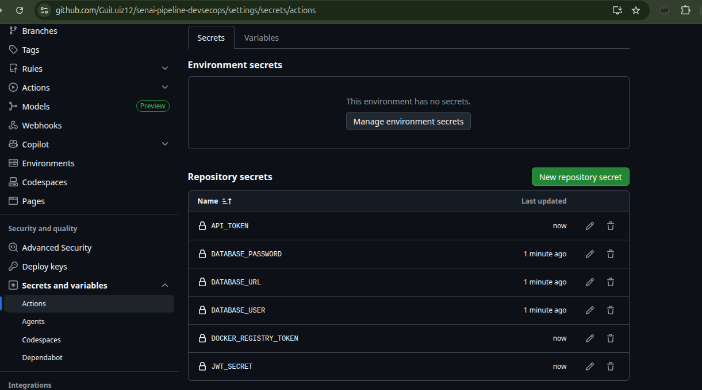
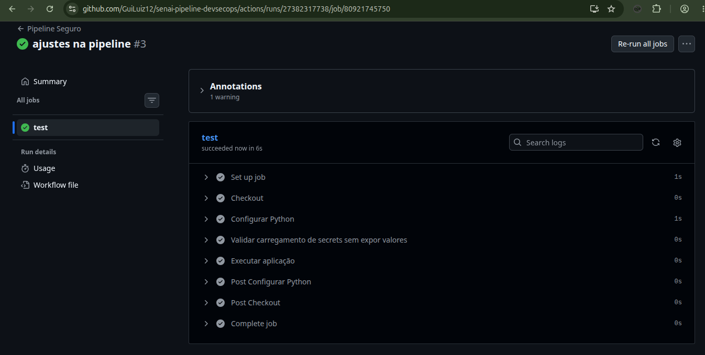

# DevSecOps Secrets Lab — SecureBank Analytics S.A.

Relatório técnico da atividade de proteção de secrets em pipelines DevSecOps.

**Repositório:** [GuiLuiz12/senai-pipeline-devsecops](https://github.com/GuiLuiz12/senai-pipeline-devsecops)

---

## Estrutura do projeto

```
senai-pipeline-devsecops/
├── app/
│   └── main.py
├── .github/
│   └── workflows/
│       └── pipeline.yml
├── Dockerfile
├── .gitignore
├── .dockerignore
├── .env.example
└── README.md
```

---

## 1. Identificação dos riscos encontrados

Durante a revisão do cenário inseguro proposto na atividade, foram identificados os seguintes riscos:

| Problema | Risco |
| --- | --- |
| Senha e token hardcoded no código-fonte | Vazamento permanente no Git e no histórico do repositório |
| Token de API no código | Acesso indevido a serviços externos por terceiros |
| Impressão de secrets em `print()` / `echo` | Exposição em logs do pipeline e do container |
| Arquivo `.env` versionado | Credenciais acessíveis a qualquer pessoa com acesso ao repositório |
| `COPY .env` no Dockerfile | Secrets embutidos na imagem Docker (camadas imutáveis) |
| Secrets escritos diretamente no workflow YAML | Exposição no repositório e em forks/PRs |
| Ausência de `.gitignore` / `.dockerignore` | Risco de commit acidental de arquivos sensíveis |
| Ausência de GitHub Secrets | Falta de controle centralizado e segregação por ambiente |
| Mesmo segredo em dev, homologação e produção | Amplificação do impacto em caso de vazamento |
| Ausência de rotação de secrets | Segredo comprometido permanece válido indefinidamente |

### Exemplo de código inseguro (cenário analisado)

```python
DATABASE_USER = "admin"
DATABASE_PASSWORD = "SenhaSuperSecreta123"
API_TOKEN = "ghp_token_exemplo_123456"

print("Senha do banco:", DATABASE_PASSWORD)
print("Token da API:", API_TOKEN)
```

### Exemplo de pipeline inseguro (cenário analisado)

```yaml
- name: Exibir variáveis
  run: |
    echo "DATABASE_PASSWORD=SenhaSuperSecreta123"
    echo "API_TOKEN=ghp_token_exemplo_123456"
```

### Exemplo de Dockerfile inseguro (cenário analisado)

```dockerfile
COPY .env /app/.env
```

---

## 2. Correções aplicadas no código

O arquivo [`app/main.py`](app/main.py) foi implementado com as seguintes práticas:

- Leitura de variáveis via `os.getenv()` em vez de valores fixos
- Validação das variáveis obrigatórias (`DATABASE_USER`, `DATABASE_PASSWORD`, `API_TOKEN`)
- Confirmação de carregamento sem expor valores sensíveis (`***`)
- Simulação de conexão com banco de dados
- Simulação de chamada a API externa com token no header, sem logar o valor

```python
DATABASE_USER = os.getenv("DATABASE_USER")
DATABASE_PASSWORD = os.getenv("DATABASE_PASSWORD")
API_TOKEN = os.getenv("API_TOKEN")

print("Usuário do banco carregado:", DATABASE_USER)
print("Senha do banco carregada:", "***")
print("Token da API carregado:", "***")
```

---

## 3. Arquivos `.gitignore` e `.dockerignore`

### `.gitignore`

Impede que arquivos sensíveis sejam versionados no Git:

```
.env
*.key
*.pem
id_rsa
credentials.json
secrets/
```

### `.dockerignore`

Impede que secrets entrem no contexto de build da imagem Docker:

```
.env
*.key
*.pem
id_rsa
credentials.json
secrets/
.git
.github
```

### `.env.example`

Contém apenas os nomes das variáveis, sem valores reais:

```
DATABASE_URL=
DATABASE_USER=
DATABASE_PASSWORD=
API_TOKEN=
JWT_SECRET=
DOCKER_REGISTRY_TOKEN=
```

---

## 4. Workflow seguro do GitHub Actions

O pipeline em [`.github/workflows/pipeline.yml`](.github/workflows/pipeline.yml) aplica:

- `permissions: contents: read` (menor privilégio)
- Secrets injetados via `${{ secrets.* }}` no bloco `env` do job
- Mensagens de log genéricas, sem imprimir valores sensíveis
- Setup explícito do Python 3.11

```yaml
env:
  DATABASE_USER: ${{ secrets.DATABASE_USER }}
  DATABASE_PASSWORD: ${{ secrets.DATABASE_PASSWORD }}
  API_TOKEN: ${{ secrets.API_TOKEN }}
  JWT_SECRET: ${{ secrets.JWT_SECRET }}
```

---

## 5. Evidência dos secrets configurados no GitHub

**Caminho:** `Settings → Secrets and variables → Actions → Repository secrets`

Secrets a configurar (valores fictícios para o laboratório):

| Secret | Status |
| --- | --- |
| `DATABASE_USER` | Configurado |
| `DATABASE_PASSWORD` | Configurado |
| `API_TOKEN` | Configurado |
| `JWT_SECRET` | Configurado |

> **Evidência:** Inserir screenshot da tela de Repository secrets mostrando os nomes dos secrets com valores ocultos (`***`).



---

## 6. Evidência da execução do pipeline

Após o push para a branch `main`, o workflow **Pipeline Seguro** é disparado automaticamente.

**Verificação:** `Actions → Pipeline Seguro → último run`

Saída esperada no step "Validar carregamento de secrets sem expor valores":

```
Secrets carregados com sucesso.
DATABASE_USER configurado.
DATABASE_PASSWORD protegido.
API_TOKEN protegido.
```

Saída esperada no step "Executar aplicação":

```
Iniciando aplicação SecureBank Analytics...
Conectando ao banco (...) como: <usuario>
Senha do banco carregada: ***
Token da API carregado: ***
Aplicação executada com sucesso.
```

> **Evidência:** Inserir screenshot do pipeline com status verde (success).



---

## 7. Evidência do build Docker

### Build da imagem

```bash
docker build -t devsecops-secrets-lab .
```

### Execução segura com variáveis em runtime

```bash
docker run --rm \
  -e DATABASE_USER="usuario_teste" \
  -e DATABASE_PASSWORD="senha_teste" \
  -e API_TOKEN="token_teste" \
  -e JWT_SECRET="jwt_teste" \
  devsecops-secrets-lab
```

### Verificar ausência de `.env` na imagem

```bash
docker run --rm devsecops-secrets-lab ls -la /app/
```

O arquivo `.env` **não** deve estar presente na imagem.

### Saída esperada

```
Iniciando aplicação SecureBank Analytics...
Conectando ao banco (postgresql://localhost:5432/securebank) como: usuario_teste
Senha do banco carregada: ***
Conexão com banco simulada com sucesso.
Token da API carregado: ***
JWT_SECRET carregado: ***
Aplicação executada com sucesso.
```

---

## 8. Matriz de riscos e correções

| Item analisado | Risco identificado | Correção aplicada | Situação final |
| --- | --- | --- | --- |
| Código-fonte | Secrets hardcoded e impressos em logs | Uso de `os.getenv()` e mascaramento com `***` | Protegido |
| Arquivo `.env` | Credenciais versionadas no Git | `.env` ignorado; apenas `.env.example` no repositório | Protegido |
| `.gitignore` | Commit acidental de arquivos sensíveis | Regras para `.env`, chaves, certificados e `secrets/` | Protegido |
| Dockerfile | `COPY .env` embute secrets na imagem | Apenas `COPY app/`; secrets em runtime | Protegido |
| `.dockerignore` | Secrets no contexto de build | Exclusão de `.env`, chaves e `.git` | Protegido |
| GitHub Actions | Secrets no YAML e `echo` nos logs | `${{ secrets.* }}` e mensagens genéricas | Protegido |
| Logs do pipeline | Exposição de senhas e tokens | Logs confirmam carregamento sem revelar valores | Protegido |
| GitHub Secrets | Falta de armazenamento centralizado | Secrets configurados no repositório GitHub | Protegido |
| Imagem Docker | Secrets em camadas da imagem | Variáveis passadas via `-e` em runtime | Protegido |

---

## 9. Proposta de hardening

| Área | Recomendação |
| --- | --- |
| Código | Nunca armazenar secrets diretamente no código-fonte; usar variáveis de ambiente ou secret managers |
| Git | Manter `.gitignore` atualizado; habilitar secret scanning e push protection no GitHub |
| Pipeline | Não imprimir secrets em logs; usar `::add-mask::` para valores sensíveis quando necessário |
| GitHub Actions | Usar repository secrets ou environment secrets com proteção de branch |
| Docker | Não copiar `.env`, chaves ou certificados para a imagem; usar runtime injection |
| Registry | Escanear imagens com Trivy ou Snyk antes da publicação |
| Produção | Adotar HashiCorp Vault, AWS Secrets Manager ou Azure Key Vault |
| Rotação | Definir processo de troca periódica de secrets (ex.: a cada 90 dias) |
| Incidente | Revogar secrets expostos imediatamente e auditar o histórico do Git |
| Governança | Manter inventário de secrets por aplicação e responsável |

---

## 10. Conclusão

A solução implementada separa claramente **código**, **configuração** e **segredos**. Os valores sensíveis não estão presentes no repositório, no Dockerfile nem nos logs do pipeline. O GitHub Secrets centraliza o armazenamento para o CI/CD, enquanto o Docker recebe as variáveis apenas em tempo de execução.

Os principais vetores de vazamento identificados na atividade — código hardcoded, `.env` versionado, `COPY .env` no Docker e `echo` de secrets no workflow — foram eliminados. A matriz de riscos confirma situação **Protegido** em todos os itens analisados.

Para ambiente de produção, recomenda-se evoluir para um secret manager dedicado, rotação automatizada e scanning contínuo de repositório e imagens.

---

## Como executar localmente

### Pré-requisitos

- Python 3.11+
- Docker (opcional, para teste de container)
- Git

### Configuração

```bash
git clone https://github.com/GuiLuiz12/senai-pipeline-devsecops.git
cd senai-pipeline-devsecops
cp .env.example .env
# Edite .env com valores fictícios de teste
```

### Validar que `.env` não será versionado

```bash
git status
# O arquivo .env NÃO deve aparecer como untracked (está no .gitignore)
```

### Executar a aplicação

```bash
export $(grep -v '^#' .env | xargs)  # Linux/macOS
python app/main.py
```

### Build e execução Docker

```bash
docker build -t devsecops-secrets-lab .
docker run --rm \
  -e DATABASE_USER="usuario_teste" \
  -e DATABASE_PASSWORD="senha_teste" \
  -e API_TOKEN="token_teste" \
  -e JWT_SECRET="jwt_teste" \
  devsecops-secrets-lab
```

### Configurar GitHub Secrets (antes do primeiro push)

1. Acesse o repositório no GitHub
2. `Settings → Secrets and variables → Actions`
3. `New repository secret` para cada variável: `DATABASE_USER`, `DATABASE_PASSWORD`, `API_TOKEN`, `JWT_SECRET`
4. Faça push para `main` e verifique em `Actions`
